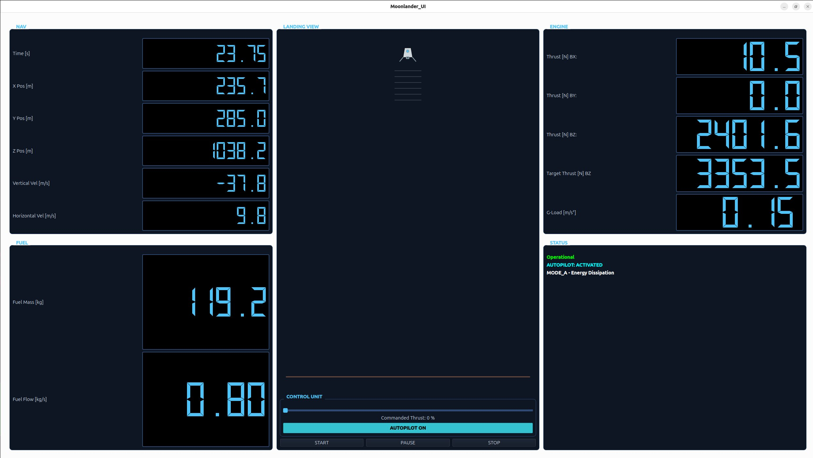

# Moonlander 🚀
C++ Lunar Landing Simulation

Moonlander is a **modular C++ lunar landing simulation** designed for experimenting with spacecraft guidance algorithms, control systems, and physics-based simulation.

The project separates a **simulation backend** from a **Qt-based cockpit UI**, enabling real-time telemetry and visualization of spacecraft descent.

Moonlander is intended for developers interested in:

- aerospace simulations
- spacecraft guidance and control algorithms
- physics-based simulations
- modular C++ architecture
- autopilot and landing strategies

🌐 **Project Website**  
https://aerospace-simulation.dev

---

# 🚀 Demo

Moonlander provides a cockpit-style interface displaying spacecraft telemetry during descent.

Telemetry includes:

- altitude
- vertical velocity
- thrust level
- remaining fuel
- hull integrity
- autopilot status

The landing view visualizes the spacecraft approaching the lunar surface.



---

# ✨ Features

- Modular simulation architecture
- Interchangeable physics models
- Integrator abstraction layer
- Adaptive descent autopilot controller
- Real-time telemetry cockpit interface
- Qt-based graphical frontend
- Threaded simulation backend
- JSON-based spacecraft configuration
- Runtime spacecraft selection
- Experimental thrust optimization using NLopt

---

# ⚙️ Quick Start

## Requirements

- C++20
- Qt6
- NLopt library
- GCC or Clang

Install NLopt on Linux:

```bash
sudo apt install libnlopt-dev
```

## Build

```bash
git clone https://github.com/gerd-lrt-dev/moonlander.git
cd moonlander
mkdir build
cd build
cmake ..
make
```

## Run

```bash
./moonlander
```

---

# 🧠 Architecture Overview

Moonlander follows a **modular simulation architecture** where physics, control systems, sensors, and visualization are separated.

The main system components include:

### Physics Models
Compute forces and environmental effects such as lunar gravity.

### Integrators
Advance spacecraft state using numerical integration methods.

### Controllers
Generate thrust commands based on spacecraft state and guidance algorithms.

### Sensors
Provide telemetry derived from spacecraft state such as proper G-load.

### Simulation Core
Coordinates the simulation loop and manages spacecraft state updates.

### Frontend UI
Displays telemetry and visualizes the spacecraft during descent.

📚 Detailed architecture documentation:

docs/architecture.md

---

# 🤖 Adaptive Descent Controller

Moonlander includes an **energy-based autopilot controller** capable of performing automated lunar landings.

The controller evaluates spacecraft altitude, velocity, and thrust limits to compute safe descent trajectories.

Controller features include:

- brake ratio based descent planning
- adaptive gain scheduling
- gravity compensation
- thrust saturation handling
- phase-based descent control logic

📚 Technical details:

docs/adaptive_descent_controller.md

---

# 🛰 Spacecraft Configuration

Spacecraft are defined using **JSON configuration files**.

This allows new spacecraft variants to be added **without recompiling the simulation**.

Typical configuration parameters include:

- spacecraft mass
- fuel capacity
- engine thrust limits
- engine response characteristics
- geometry parameters

Configurations are loaded at runtime using the `ConfigManager`.

---

# 🗺 Roadmap

## Short-Term

- stabilize telemetry display
- extend Logger with log levels
- implement additional sensors
- stabilize thrust optimization

## Mid-Term

- full 3D spacecraft model
- orbital mechanics simulation
- controller testing environment

## Long-Term

- simulation replay system
- terrain modelling
- environmental effects
- multi-spacecraft simulations

---

# 🤝 Contributing

Contributions are welcome.

Areas where help is appreciated include:

- new autopilot algorithms
- additional sensor models
- improved physics models
- UI improvements
- optimization experiments

Typical contribution workflow:

1. Fork the repository
2. Create a feature branch
3. Implement your changes
4. Open a pull request

If you're looking for a starting point, check issues labeled:

- `good first issue`
- `help wanted`

---

# 📚 Documentation

Additional technical documentation can be found in the `docs` directory.

Example documentation files:

docs/architecture.md  
docs/adaptive_descent_controller.md

---

# 📜 License

This project is open source.  
License information will be provided in the repository.