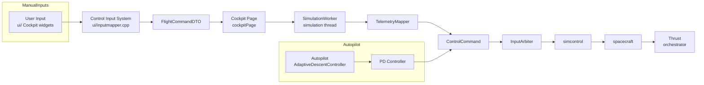
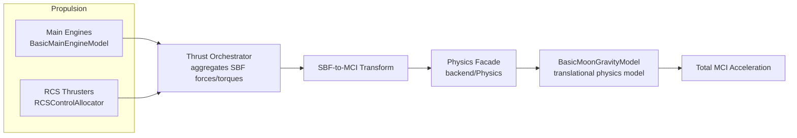
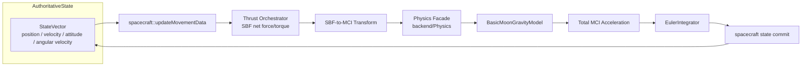
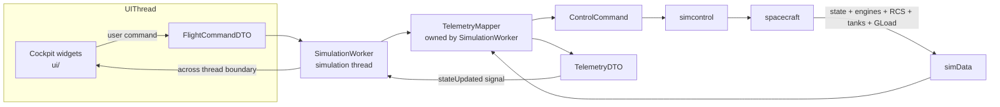
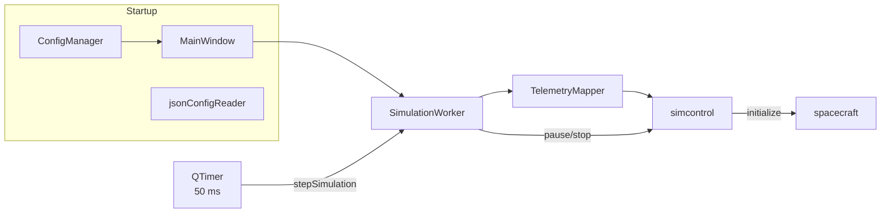

# SDF Core Data Flow Documentation

This document describes the most important data flows inside the **Spaceflight Dynamics Framework (SDF)**.
It is intended as architectural reference material for future contributors and to support future refactoring efforts.

The diagrams below focus on **architectural data flow and ownership** as of the current `main` branch. They are grouped around the runtime backbone:

```text
Manual Frontend Input
        ↓
FlightCommandDTO
        ↓
SimulationWorker / TelemetryMapper
        ↓
ControlCommand
        ↓
InputArbiter
        ← Autopilot (spacecraft state → AdaptiveDescentController → PD → ControlCommand)
        ↓
Actuation / Propulsion
        ↓
SBF Forces + Torques
        ↓
SBF-to-MCI Transform
        ↓
Physics Facade (physics::computeAcc)
        ↓
BasicMoonGravityModel
        ↓
Total MCI Acceleration
        ↓
Numerical Integration (EulerIntegrator)
        ↓
Authoritative StateVector
        ↓
Derived Frame Context
        ↓
simData
        ↓
TelemetryMapper
        ↓
TelemetryDTO
        ↓
Qt Thread Boundary
        ↓
Cockpit / Visualization
```

---

## Table of Contents

1. [Control Input to Applied Forces](#diagram-1-control-input-to-applied-forces)
2. [Force Generation to Physics Calculation](#diagram-2-force-generation-to-physics-calculation)
3. [Physics Calculation to State Propagation](#diagram-3-physics-calculation-to-state-propagation)
4. [Frontend ↔ Backend Communication](#diagram-4-frontend--backend-communication)
5. [Simulation Lifecycle](#diagram-5-simulation-lifecycle)
6. [Subsystem Responsibilities](#subsystem-responsibilities)
7. [State Ownership Summary](#state-ownership-summary)

---

## Diagram 1: Control Input to Applied Forces

This diagram shows the complete control-input processing chain, from user/autopilot commands down to the forces and torques that enter the physics simulation. The concrete runtime path on current `main` is:

`inputmapper → FlightCommandDTO → cockpitPage → SimulationWorker → TelemetryMapper → ControlCommand → InputArbiter → simcontrol → spacecraft → Thrust`



### Ownership & responsibilities

- **User Input / Autopilot** — owns the *intent* (what the spacecraft should do).
- **`ui/inputmapper`** — translates raw input events (keyboard, throttle slider, etc.) into a normalized `FlightCommandDTO`.
- **`cockpitPage`** — forwards the `FlightCommandDTO` to the worker living on the simulation thread.
- **`SimulationWorker`** — owns the simulation thread boundary; receives frontend DTOs and drives the per-step processing.
- **`TelemetryMapper`** — converts `FlightCommandDTO` into backend `ControlCommand` objects.
- **`InputArbiter`** — decides which command source wins in a given mode (manual vs. autopilot) and routes the actuation request.
- **`simcontrol`** — simulation orchestrator; applies the command to the `spacecraft` model.
- **`Thrust`** — propulsion orchestrator; converts actuator commands into the actual forces and torques.

### Manual vs. autopilot paths

The two command paths remain separate until `InputArbiter`, which combines or selects the applicable command fields before `simcontrol` forwards them to the spacecraft systems.

- **Manual path**: `inputmapper → FlightCommandDTO → cockpitPage → SimulationWorker → TelemetryMapper → ControlCommand → InputArbiter`.
- **Autopilot path**: `spacecraft state → AdaptiveDescentController → PD_Controller → ControlCommand → InputArbiter`. The PD controller belongs specifically to the automated-descent path, not the generic manual actuation path.

### Rotational command actuation

`ControlCommand.rotation` now reaches the rotational RCS path:

`InputArbiter → simcontrol → spacecraft::setTargetRCSThrust(..., RCS_rotation) → Thrust → RCSControlAllocator → rotational RCS actuators`

The `stabilize` and `killRotation` flags are still not fully processed and remain documented as incomplete.

---

## Diagram 2: Force Generation to Physics Calculation

This diagram shows how propulsion forces and environmental models feed into the acceleration calculation. There is **no general force accumulator** that combines every physical force before the physics model; instead, forces are handled by their respective owners.



### Force sources and acceleration calculation

- **Propulsion** — main engines and RCS thrusters produce forces/torques in the spacecraft body frame (SBF). The `Thrust` orchestrator aggregates these into net SBF thrust force and torque.
- **Translational physics model** — `BasicMoonGravityModel` is the currently configured implementation behind `physics::computeAcc()`. The aggregated SBF thrust is transformed into the MCI frame, then `physics::computeAcc()` calls `BasicMoonGravityModel::computeAcceleration()` and combines gravity acceleration with thrust / mass to produce the total MCI acceleration. `BasicMoonGravityModel` is therefore not a parallel force source; it is the concrete physics model called through the `physics` façade.
- **Aerodynamics** — not currently implemented; intended as a future extension.

### Controller output is actuation input

Controller output (e.g., the PD controller in automated descent, or RCS commands) is a *command or actuation input* to the propulsion models, not a separate physical force source. The propulsion models own conversion from command to force/torque.

### Integration boundaries

The physics façade derives linear and angular acceleration from the rigid-body equations of motion. The net propulsion force/torque and gravity are combined inside `physics::computeAcc()`; the integrator consumes the resulting accelerations (see Diagram 3).

---

## Diagram 3: Physics Calculation to State Propagation

This diagram shows how simulation state is propagated from one time step to the next. The authoritative state lives in `spacecraft`; `spacecraft::updateMovementData()` coordinates the physics and integration calls and then commits the individual results.



### State ownership

- **Authoritative `StateVector`** — owned by the `spacecraft` object; single source of truth for position, velocity, attitude, and angular velocity.
- **`spacecraft::updateMovementData()`** — coordinates the physics and integration calls and commits the results back to the authoritative state.
- **`Thrust` orchestrator** — aggregates net SBF force/torque from main engines and RCS.
- **`backend/Physics`** — façade for translational and rotational physics; calls `BasicMoonGravityModel` through `physics::computeAcc()` and combines gravity with thrust / mass. It does not mutate state directly.
- **`BasicMoonGravityModel`** — the currently configured translational physics model; computes gravitational acceleration and combines it with thrust / mass inside `physics::computeAcc()`.
- **`backend/Integrators/EulerIntegrator`** — advances individual quantities (velocity, position, angular velocity, attitude) one time step. It does **not** construct or own a complete new `StateVector`.

### Update workflow

1. `spacecraft::updateMovementData()` reads the current state.
2. `Thrust` aggregates net SBF force/torque from propulsion.
3. The SBF thrust is transformed into MCI; `physics::computeAcc()` calls `BasicMoonGravityModel::computeAcceleration()` and combines gravity with thrust / mass to produce total MCI acceleration.
4. Rotational physics computes angular acceleration from net torque.
5. `EulerIntegrator` advances each state component individually.
6. `spacecraft` commits the updated values back to the authoritative `StateVector`.

### Numerical integration

Only `EulerIntegrator` is currently implemented. RK4 or other integrators should be considered future implementations and are not part of the current runtime path.

---

## Diagram 4: Frontend ↔ Backend Communication

This diagram shows the two-directional communication between the Qt cockpit UI and the simulation backend. The concrete boundary is the **Qt signal/slot mechanism between the UI thread and `SimulationWorker`, which lives in the simulation thread**.



### Downlink flow: UI → Backend

- User actions in cockpit widgets produce a `FlightCommandDTO`.
- `cockpitPage` passes the DTO to `SimulationWorker` ( queued across threads ).
- `SimulationWorker` calls `TelemetryMapper` to convert the DTO into a backend `ControlCommand`.
- `ControlCommand` flows through `InputArbiter` → `simcontrol` → `spacecraft` → actuation/propulsion.
- All command mapping happens **in-process** between C++ data structures; there is no serialization step.

### Uplink flow: Backend → UI

- At the end of a simulation step, `spacecraft` aggregates state, engines, RCS, tanks, and G-load data into `simData`.
- `TelemetryMapper` converts `simData` into a `TelemetryDTO`.
- `SimulationWorker` emits `stateUpdated(TelemetryDTO)` via Qt signal/slot.
- `cockpitPage::onStateUpdated` receives the DTO and updates the instrument widgets.

### Thread ownership

- **UI state** (widgets, displays) is owned by the UI thread.
- **Simulation state** (`spacecraft`, `simcontrol`, `TelemetryMapper`, `simData`) is owned by the simulation thread via `SimulationWorker`.
- **DTOs** are value objects passed across the thread boundary by signal/slot; they do not contain shared mutable state.

---

## Diagram 5: Simulation Lifecycle

This diagram captures configuration loading, initialization, the per-step clock, and pause/stop controls.



### Lifecycle steps

1. **Configuration loading** (DF-001): `ConfigManager → MainWindow → SimulationWorker → TelemetryMapper → simcontrol → jsonConfigReader → spacecraft`.
2. **Initialization** (DF-002): `SimulationWorker::start → TelemetryMapper::initialize → simcontrol::initialize → spacecraft construction → mission frames + engines`.
3. **Run loop** (DF-003): a 50 ms `QTimer` drives `SimulationWorker::stepSimulation → runStepSimulation(0.05) → simcontrol::runSimulation`.
4. **Pause / stop** (DF-004): cockpit actions call `SimulationWorker::pause` / `stop`.

---

## Subsystem Responsibilities

| Subsystem | Primary Responsibility | Owns State? | Thread |
|---|---|---|---|
| `ui/` (Cockpit / widgets) | Render telemetry, capture user input | Yes — UI state | UI thread |
| `interface/` (DTOs / Mapper) | Translate between UI and backend representations | No — pure data contracts / owned by SimulationWorker | Simulation thread |
| `SimulationWorker` | Own the simulation thread, drive step loop, ferry DTOs across thread boundary | Yes — worker lifecycle | Simulation thread |
| `simcontrol` | Orchestrate each simulation step | No — orchestration logic | Simulation thread |
| `spacecraft` | Hold and commit authoritative `StateVector`, coordinate movement update | Yes — simulation state | Simulation thread |
| `backend/Physics` | Compute accelerations from forces/torques | No — read-only physics model | Simulation thread |
| `BasicMoonGravityModel` | Compute gravitational acceleration | No — physics model | Simulation thread |
| `backend/Integrators/EulerIntegrator` | Advance individual state components in time | No — computation only | Simulation thread |
| `backend/Control` / `Controller` / `InputArbiter` | Map/routes commands to actuator signals | No — control logic | Simulation thread |
| `backend/Thrust` | Convert actuator commands to forces/torques | No — propulsion model | Simulation thread |

---

## State Ownership Summary

- **Input intent** is owned by the user / autopilot.
- **Control commands** are owned by `inputmapper` (frontend DTO) and `InputArbiter` (backend routing).
- **Forces and torques** are computed by `Thrust` and `BasicMoonGravityModel` but are transient values for the current frame.
- **Authoritative `StateVector`** is the single source of truth for the simulation and is updated by `spacecraft::updateMovementData()` after integration.
- **`simData`** is the per-step telemetry snapshot produced by `spacecraft`.
- **UI state** is a read-only view of the simulation state, refreshed through `TelemetryDTO` across the Qt signal/slot boundary.

---

## Notes

- These diagrams intentionally omit class-level detail; for implementation specifics, see the header files in `backend/include/` and the UI sources in `ui/`.
- The boundary between subsystems is designed to keep coupling low: the physics model does not know about the UI, and the UI does not directly modify simulation state.
- Website publication of these diagrams is tracked as a follow-up issue in the website repository and is not part of this PR.
