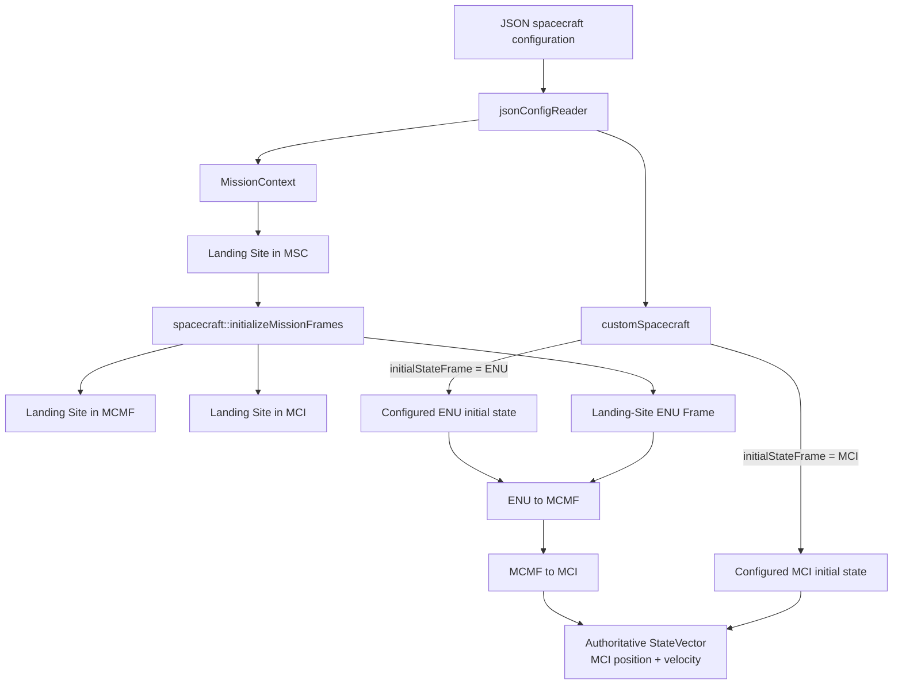
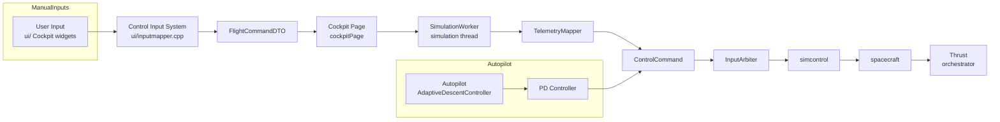
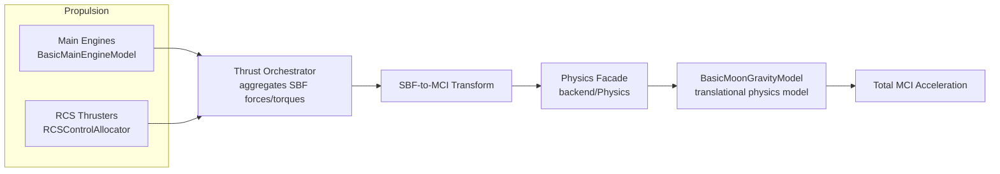
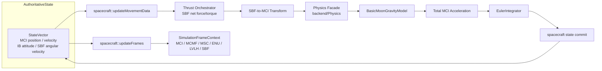
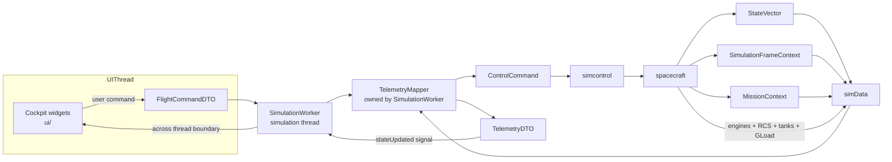
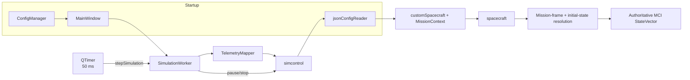
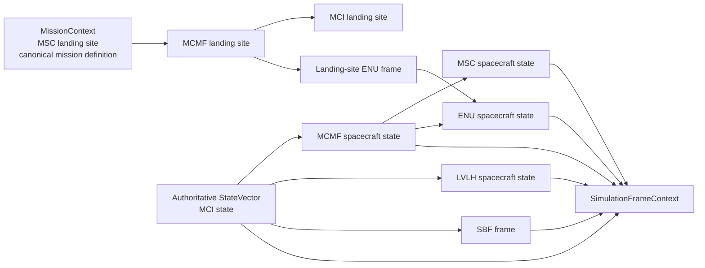

# SDF Core Data Flow Documentation

This document describes the most important data flows inside the **Spaceflight Dynamics Framework (SDF)**.
It is intended as architectural reference material for future contributors and to support future refactoring efforts.

The diagrams below focus on **architectural data flow and ownership** as of the current `main` branch. They cover both initialization and runtime execution.

A central architectural rule is that the configured spacecraft state may be expressed in different input frames, while the propagated runtime state is resolved once into **Moon-Centered Inertial (MCI)** coordinates and remains authoritative there.

```text
Configuration
        ↓
Initial-State Resolution
        ↓
Authoritative MCI StateVector
        ↓
Physics / Integration
        ↓
Derived Frame Context
        ↓
simData / Telemetry
        ↓
Cockpit / Visualization
```

The runtime control backbone is:

```text
Manual Frontend Input
        ↓
FlightCommandDTO
        ↓
SimulationWorker / TelemetryMapper
        ↓
ControlCommand
        ↓
InputArbiter
        ← Autopilot (spacecraft state → AdaptiveDescentController → PD → ControlCommand)
        ↓
Actuation / Propulsion
        ↓
SBF Forces + Torques
        ↓
SBF-to-MCI Transform
        ↓
Physics Facade (physics::computeAcc)
        ↓
BasicMoonGravityModel
        ↓
Total MCI Acceleration
        ↓
Numerical Integration (EulerIntegrator)
        ↓
Authoritative StateVector
        ↓
SimulationFrameContext
        ↓
simData
        ↓
TelemetryMapper
        ↓
TelemetryDTO
        ↓
Qt Thread Boundary
        ↓
Cockpit / Visualization
```

---

## Table of Contents

1. [Configuration to Authoritative Runtime State](#diagram-0-configuration-to-authoritative-runtime-state)
2. [Control Input to Applied Forces](#diagram-1-control-input-to-applied-forces)
3. [Force Generation to Physics Calculation](#diagram-2-force-generation-to-physics-calculation)
4. [Physics Calculation to State Propagation](#diagram-3-physics-calculation-to-state-propagation)
5. [Frontend ↔ Backend Communication](#diagram-4-frontend--backend-communication)
6. [Simulation Lifecycle](#diagram-5-simulation-lifecycle)
7. [Mission and Runtime Frame Context](#diagram-6-mission-and-runtime-frame-context)
8. [Subsystem Responsibilities](#subsystem-responsibilities)
9. [State Ownership Summary](#state-ownership-summary)

---

## Diagram 0: Configuration to Authoritative Runtime State

D31 introduced landing-site-relative spacecraft initialization while preserving direct MCI initialization.

The configuration therefore describes **how the initial state is expressed**, not which frame the physics engine propagates.

Supported initial-state modes are:

- `positionFrame = "ENU"` together with `velocityFrame = "ENU"`
- `positionFrame = "MCI"` together with `velocityFrame = "MCI"`

Mixed position/velocity frame combinations are rejected by `jsonConfigReader`.



### Initialization ownership

- **`jsonConfigReader`** parses the configured initial-state representation and validates that position and velocity use the same supported frame.
- **`customSpacecraft`** owns the spacecraft-specific configuration, including the selected `InitialStateFrame` and the configured ENU or MCI initial state.
- **`MissionContext`** owns persistent mission references. The landing site is configured canonically in MSC and is resolved during initialization into MCMF, MCI, and an ENU frame.
- **`spacecraft::setDefaultValues()`** performs the one-time initial-state resolution.
- **`StateVector::MCI_Position` / `StateVector::MCI_Velocity`** become authoritative once initialization is complete.

### ENU initialization

For landing-site-relative initialization:

```text
Landing Site MSC
        ↓
MCMF landing-site state
        ↓
Landing-site ENU frame
        ↓
Configured ENU spacecraft state
        ↓
ENU → MCMF
        ↓
MCMF → MCI
        ↓
StateVector
```

ENU is therefore an **input and mission/navigation representation**, not the physics integration frame.

### Direct MCI initialization

For direct MCI initialization, the configured MCI position and velocity are assigned directly to the runtime state without passing through the landing-site-relative conversion chain.

This preserves low-level, orbital, and verification scenarios that are naturally specified in inertial coordinates.

---

## Diagram 1: Control Input to Applied Forces

This diagram shows the complete control-input processing chain, from user/autopilot commands down to the forces and torques that enter the physics simulation. The concrete runtime path on current `main` is:

`inputmapper → FlightCommandDTO → cockpitPage → SimulationWorker → TelemetryMapper → ControlCommand → InputArbiter → simcontrol → spacecraft → Thrust`



### Ownership & responsibilities

- **User Input / Autopilot** — owns the *intent* (what the spacecraft should do).
- **`ui/inputmapper`** — translates raw input events (keyboard, throttle slider, etc.) into a normalized `FlightCommandDTO`.
- **`cockpitPage`** — forwards the `FlightCommandDTO` to the worker living on the simulation thread.
- **`SimulationWorker`** — owns the simulation thread boundary; receives frontend DTOs and drives the per-step processing.
- **`TelemetryMapper`** — converts `FlightCommandDTO` into backend `ControlCommand` objects.
- **`InputArbiter`** — decides which command source wins in a given mode (manual vs. autopilot) and routes the actuation request.
- **`simcontrol`** — simulation orchestrator; applies the command to the `spacecraft` model.
- **`Thrust`** — propulsion orchestrator; converts actuator commands into the actual forces and torques.

### Manual vs. autopilot paths

The two command paths remain separate until `InputArbiter`, which combines or selects the applicable command fields before `simcontrol` forwards them to the spacecraft systems.

- **Manual path**: `inputmapper → FlightCommandDTO → cockpitPage → SimulationWorker → TelemetryMapper → ControlCommand → InputArbiter`.
- **Autopilot path**: `spacecraft state → AdaptiveDescentController → PD_Controller → ControlCommand → InputArbiter`. The PD controller belongs specifically to the automated-descent path, not the generic manual actuation path.

### Rotational command actuation

`ControlCommand.rotation` reaches the rotational RCS path:

`InputArbiter → simcontrol → spacecraft::setTargetRCSThrust(..., RCS_rotation) → Thrust → RCSControlAllocator → rotational RCS actuators`

The `stabilize` and `killRotation` flags are still not fully processed and remain documented as incomplete.

---

## Diagram 2: Force Generation to Physics Calculation

This diagram shows how propulsion forces and environmental models feed into the acceleration calculation. There is **no general force accumulator** that combines every physical force before the physics model; instead, forces are handled by their respective owners.



### Force sources and acceleration calculation

- **Propulsion** — main engines and RCS thrusters produce forces/torques in the spacecraft body frame (SBF). The `Thrust` orchestrator aggregates these into net SBF thrust force and torque.
- **Translational physics model** — `BasicMoonGravityModel` is the currently configured implementation behind `physics::computeAcc()`. The aggregated SBF thrust is transformed into the MCI frame, then `physics::computeAcc()` calls `BasicMoonGravityModel::computeAcceleration()` and combines gravity acceleration with thrust / mass to produce the total MCI acceleration. `BasicMoonGravityModel` is therefore not a parallel force source; it is the concrete physics model called through the `physics` façade.
- **Aerodynamics** — not currently implemented; intended as a future extension.

### Controller output is actuation input

Controller output (e.g., the PD controller in automated descent, or RCS commands) is a *command or actuation input* to the propulsion models, not a separate physical force source. The propulsion models own conversion from command to force/torque.

### Integration boundaries

The physics façade derives linear and angular acceleration from the rigid-body equations of motion. The net propulsion force/torque and gravity are combined inside `physics::computeAcc()`; the integrator consumes the resulting accelerations (see Diagram 3).

---

## Diagram 3: Physics Calculation to State Propagation

This diagram shows how simulation state is propagated from one time step to the next. The authoritative translational state is propagated in MCI. `spacecraft::updateMovementData()` coordinates the physics and integration calls and commits the individual results to `StateVector`.



### State ownership

- **Authoritative `StateVector`** — owned by the `spacecraft` object; source of truth for propagated spacecraft position, velocity, attitude, and angular velocity.
- **MCI position / velocity** — authoritative translational runtime representation used by physics and integration.
- **`spacecraft::updateMovementData()`** — coordinates the physics and integration calls and commits the results back to the authoritative state.
- **`Thrust` orchestrator** — aggregates net SBF force/torque from main engines and RCS.
- **`backend/Physics`** — façade for translational and rotational physics; calls `BasicMoonGravityModel` through `physics::computeAcc()` and combines gravity with thrust / mass. It does not mutate state directly.
- **`BasicMoonGravityModel`** — the currently configured translational physics model; computes gravitational acceleration and combines it with thrust / mass inside `physics::computeAcc()`.
- **`backend/Integrators/EulerIntegrator`** — advances individual quantities (velocity, position, angular velocity, attitude) one time step. It does **not** construct or own a complete new `StateVector`.
- **`SimulationFrameContext`** — stores derived frame representations reconstructed from the current authoritative state. These values are not integrated directly.

### Update workflow

1. `spacecraft::updateMovementData()` reads the current authoritative state.
2. `Thrust` aggregates net SBF force/torque from propulsion.
3. The SBF thrust is transformed into MCI; `physics::computeAcc()` calls `BasicMoonGravityModel::computeAcceleration()` and combines gravity with thrust / mass to produce total MCI acceleration.
4. Rotational physics computes angular acceleration from net torque.
5. `EulerIntegrator` advances each state component individually.
6. `spacecraft` commits the updated values back to `StateVector`.
7. `spacecraft::updateFrames(time)` derives MCMF, MSC, ENU, LVLH, and SBF representations from the updated state.

### Numerical integration

Only `EulerIntegrator` is currently implemented. RK4 or other integrators should be considered future implementations and are not part of the current runtime path.

---

## Diagram 4: Frontend ↔ Backend Communication

This diagram shows the two-directional communication between the Qt cockpit UI and the simulation backend. The concrete boundary is the **Qt signal/slot mechanism between the UI thread and `SimulationWorker`, which lives in the simulation thread**.



### Downlink flow: UI → Backend

- User actions in cockpit widgets produce a `FlightCommandDTO`.
- `cockpitPage` passes the DTO to `SimulationWorker` (queued across threads).
- `SimulationWorker` calls `TelemetryMapper` to convert the DTO into a backend `ControlCommand`.
- `ControlCommand` flows through `InputArbiter` → `simcontrol` → `spacecraft` → actuation/propulsion.
- All command mapping happens **in-process** between C++ data structures; there is no serialization step.

### Uplink flow: Backend → UI

- At the end of a simulation step, `spacecraft` aggregates the authoritative `StateVector`, `SimulationFrameContext`, `MissionContext`, propulsion state, tanks, G-load, integrity, and console output into `simData`.
- `TelemetryMapper` maps the authoritative MCI navigation state and the derived MCI/MCMF/MSC/ENU/LVLH frame states into `TelemetryDTO`.
- `SimulationWorker` emits `stateUpdated(TelemetryDTO)` via Qt signal/slot.
- `cockpitPage::onStateUpdated` receives the DTO and updates the instrument widgets.

### Thread ownership

- **UI state** (widgets, displays) is owned by the UI thread.
- **Simulation state** (`spacecraft`, `simcontrol`, `TelemetryMapper`, `StateVector`, `MissionContext`, `SimulationFrameContext`) is owned by the simulation thread via `SimulationWorker`.
- **DTOs** are value objects passed across the thread boundary by signal/slot; they do not contain shared mutable state.

---

## Diagram 5: Simulation Lifecycle

This diagram captures configuration loading, initial-state resolution, the per-step clock, and pause/stop controls.



### Lifecycle steps

1. **Configuration loading** (DF-001): `ConfigManager → MainWindow → SimulationWorker → TelemetryMapper → simcontrol → jsonConfigReader`.
2. **Configuration parsing**: `jsonConfigReader` produces spacecraft configuration data and `MissionContext`. It validates the selected initial-state frame mode.
3. **Initialization** (DF-002): `SimulationWorker::start → TelemetryMapper::initialize → simcontrol::initialize → spacecraft construction`.
4. **Mission-frame initialization**: the canonical MSC landing site is resolved into MCMF, MCI, and the landing-site ENU frame.
5. **Initial-state resolution**: ENU input is transformed `ENU → MCMF → MCI`, while direct MCI input is accepted unchanged. The resolved state is committed to the authoritative `StateVector`.
6. **Run loop** (DF-003): a 50 ms `QTimer` drives `SimulationWorker::stepSimulation → runStepSimulation(0.05) → simcontrol::runSimulation`.
7. **Frame derivation**: after propagation, `spacecraft::updateFrames(time)` reconstructs the current `SimulationFrameContext` from the authoritative state.
8. **Pause / stop** (DF-004): cockpit actions call `SimulationWorker::pause` / `stop`.

---

## Diagram 6: Mission and Runtime Frame Context

SDF distinguishes persistent **mission reference data** from **spacecraft runtime frame representations**.



### `MissionContext`

`MissionContext` stores stable mission references that are independent of the current spacecraft state.

For the current landing implementation:

- `MSC_LandingSite` is the canonical configured landing-site definition.
- `MCMF_landingSite` is derived during initialization.
- `MCI_landingSite` is derived during initialization for inertial consumers.
- `ENU_landingSite` defines the local landing-site frame used for landing-relative navigation and telemetry.

These are **mission references**, not propagated spacecraft state.

### `SimulationFrameContext`

`SimulationFrameContext` stores the current spacecraft state represented in multiple frames:

- MCI
- MCMF
- MSC
- ENU
- LVLH
- SBF frame definition

The context is reconstructed from the current `StateVector` by `spacecraft::updateFrames()` and is intended for GNC, telemetry, visualization, validation/export, and other frame-dependent consumers.

No `SimulationFrameContext` representation is independently integrated by the physics engine.

---

## Subsystem Responsibilities

| Subsystem | Primary Responsibility | Owns State? | Thread |
|---|---|---|---|
| `ui/` (Cockpit / widgets) | Render telemetry, capture user input | Yes — UI state | UI thread |
| `interface/` (DTOs / Mapper) | Translate between UI and backend representations | No — pure data contracts / mapper owned by SimulationWorker | Simulation thread |
| `SimulationWorker` | Own the simulation thread, drive step loop, ferry DTOs across thread boundary | Yes — worker lifecycle | Simulation thread |
| `jsonConfigReader` | Parse spacecraft/mission configuration and validate initial-state frame selection | No — stateless parser | Simulation thread during initialization |
| `customSpacecraft` | Hold spacecraft configuration, including configured initial-state representation | Yes — configuration data | Simulation thread |
| `MissionContext` | Hold persistent mission references such as the landing site and derived mission reference frames | Yes — mission reference data | Simulation thread |
| `simcontrol` | Orchestrate initialization and each simulation step | No — orchestration logic | Simulation thread |
| `spacecraft` | Hold and commit authoritative `StateVector`, resolve initial state, derive runtime frame representations, coordinate movement update | Yes — simulation state | Simulation thread |
| `StateVector` | Authoritative propagated spacecraft state | Yes — owned by `spacecraft` | Simulation thread |
| `SimulationFrameContext` | Hold frame representations derived from the authoritative state | Derived state only | Simulation thread |
| `CoordinateTransformer` | Perform transformations between MCI, MCMF, MSC, ENU, LVLH, and SBF representations | No — computation only | Simulation thread |
| `backend/Physics` | Compute accelerations from forces/torques | No — read-only physics model | Simulation thread |
| `BasicMoonGravityModel` | Compute gravitational acceleration | No — physics model | Simulation thread |
| `backend/Integrators/EulerIntegrator` | Advance individual state components in time | No — computation only | Simulation thread |
| `backend/Control` / `Controller` / `InputArbiter` | Map/routes commands to actuator signals | No — control logic | Simulation thread |
| `backend/Thrust` | Convert actuator commands to forces/torques | No — propulsion model | Simulation thread |

---

## State Ownership Summary

- **Configured initial state** is owned by `customSpacecraft` and may currently be expressed either in ENU relative to the landing site or directly in MCI.
- **Mission reference data** is owned by `MissionContext`; the landing site is canonically configured in MSC and its MCMF/MCI/ENU representations are derived during initialization.
- **Authoritative runtime spacecraft state** is owned by `spacecraft` through `StateVector`.
- **MCI position and velocity** are the authoritative translational state used for propagation after initial-state resolution.
- **Derived frame state** is stored in `SimulationFrameContext` and reconstructed from the authoritative state; MCMF, MSC, ENU, and LVLH are not independently propagated.
- **Input intent** is owned by the user / autopilot.
- **Control commands** are represented by `FlightCommandDTO` on the frontend side and routed through `ControlCommand` / `InputArbiter` in the backend.
- **Forces and torques** are computed by `Thrust` and the physics models but are transient values for the current simulation step.
- **`simData`** is the per-step backend telemetry snapshot and contains `StateVector`, `MissionContext`, `SimulationFrameContext`, propulsion, fuel, integrity, sensor, and console data.
- **`TelemetryDTO`** is the frontend-facing value representation produced by `TelemetryMapper`. It includes authoritative MCI navigation data and derived frame states used by cockpit/visualization consumers.
- **UI state** is a read-only view of simulation telemetry, refreshed through `TelemetryDTO` across the Qt signal/slot boundary.

---

## Notes

- These diagrams intentionally omit most class-level implementation detail; for implementation specifics, see the header files in `backend/include/`, `interface/`, and the UI sources in `ui/`.
- The distinction between **configuration representation**, **authoritative runtime state**, **mission reference context**, and **derived frame context** is intentional and should be preserved in future refactoring.
- ENU is currently tied to the configured landing-site reference and is primarily intended for landing-relative navigation, telemetry, and guidance. The physics integration frame remains MCI.
- Propulsion forces are defined in SBF and transformed into MCI before entering translational physics. Detailed propulsion-direction and RCS validation belongs to dedicated verification activities rather than this architectural data-flow document.
- The boundary between subsystems is designed to keep coupling low: the physics model does not know about the UI, and the UI does not directly modify simulation state.
- Website publication of these diagrams is tracked separately and is not part of this documentation update.
