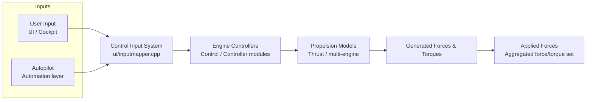
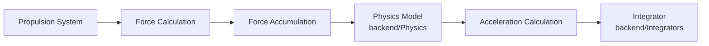
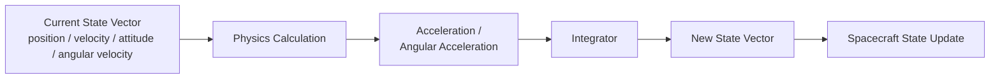
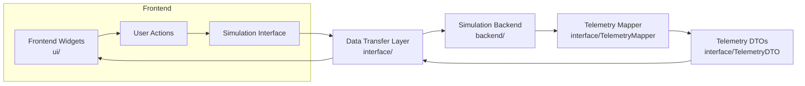

# SDF Core Data Flow Documentation

This document describes the most important data flows inside the **Spaceflight Dynamics Framework (SDF)**.
It is intended as architectural reference material for future contributors and to support future refactoring efforts.

The diagrams below focus on **architectural data flow and ownership**, not on class-level implementation details.

---

## Table of Contents

1. [Control Input to Applied Forces](#diagram-1-control-input-to-applied-forces)
2. [Force Generation to Physics Calculation](#diagram-2-force-generation-to-physics-calculation)
3. [Physics Calculation to State Propagation](#diagram-3-physics-calculation-to-state-propagation)
4. [Frontend ↔ Backend Communication](#diagram-4-frontend--backend-communication)
5. [Subsystem Responsibilities](#subsystem-responsibilities)
6. [State Ownership Summary](#state-ownership-summary)

---

## Diagram 1: Control Input to Applied Forces

This diagram shows the complete control input processing chain, from user/autopilot commands down to the forces and torques that enter the physics simulation.

### Ownership & responsibilities

- **User Input / Autopilot** — owns the *intent* (what the spacecraft should do).
- **Control Input System (`ui/inputmapper`)** — owns translating raw input events into normalized control commands.
- **Engine Controllers (`Control/Controller`)** — own mapping control commands to engine/thruster actuation.
- **Propulsion Models (`Thrust`)** — own computing the actual forces and torques produced by engines and RCS thrusters.
- **Applied Forces** — the aggregated output consumed by the physics pipeline (see Diagram 2).

---

## Diagram 2: Force Generation to Physics Calculation

This diagram shows how generated forces enter the simulation physics pipeline.

### Force sources

- Propulsion system (main engines, RCS)
- Environmental models (gravity, aerodynamics when present)
- Controller actuation

### Aggregation mechanisms

All forces and torques are summed into a net force/torque vector before being passed to the physics model.
The `backend/Physics` module then derives linear and angular acceleration from the rigid-body equations of motion.

### Integration boundaries

The integrator (`backend/Integrators`) is the last step of the physics calculation and the first step of state propagation (see Diagram 3).

---

## Diagram 3: Physics Calculation to State Propagation

This diagram shows how simulation state is propagated from one time step to the next.

### State ownership

- **Current State Vector** — owned by the spacecraft / simulation state object.
- **Physics Calculation** — owned by `backend/Physics`; computes derivatives but does not mutate state directly.
- **Integrator** — owned by `backend/Integrators`; computes the new state vector from derivatives.
- **Spacecraft State Update** — owned by the spacecraft state object; commits the new state vector as the current state for the next frame.

### Update workflow

1. Read current state vector.
2. Compute accelerations using aggregated forces/torques.
3. Run numerical integration (e.g., Euler, RK4) to advance the state.
4. Write the resulting state vector back to the spacecraft state.

---

## Diagram 4: Frontend ↔ Backend Communication

This diagram shows the two-directional communication between the Qt cockpit UI and the simulation backend.

### Downlink flow: UI → Backend

- User actions in the cockpit widgets produce control commands.
- The simulation interface serializes those commands.
- The data transfer layer forwards them to the backend systems.

### Uplink flow: Backend → UI

- The backend produces telemetry data during simulation.
- `TelemetryMapper` converts raw telemetry into `TelemetryDTO` objects.
- The data transfer layer pushes DTOs to the frontend widgets for visualization.

### Ownership & synchronization

- **UI state** (widgets, displays) is owned by the frontend thread.
- **Simulation state** is owned by the backend thread.
- **DTOs and the mapper** are owned by the interface layer and act as the synchronization boundary.
- Communication is generally one-way per direction; simultaneous access to shared state should go through the data transfer layer to avoid coupling.

---

## Subsystem Responsibilities

| Subsystem | Primary Responsibility | Owns State? |
|---|---|---|
| `ui/` (Cockpit / widgets) | Render telemetry, capture user input | Yes — UI state |
| `interface/` (DTOs / Mapper) | Translate between UI and backend representations | No — pure data contracts |
| `backend/Physics` | Compute accelerations from forces/torques | No — read-only physics model |
| `backend/Integrators` | Advance state vector in time | No — computation only |
| `backend/Control` / `Controller` | Map commands to actuator signals | No — control logic |
| `backend/Thrust` | Convert actuator signals to forces/torques | No — propulsion model |
| Spacecraft state object | Hold current position, velocity, attitude, angular velocity | Yes — simulation state |

---

## State Ownership Summary

- **Input intent** is owned by the user / autopilot.
- **Control commands** are owned by the input mapper and controllers.
- **Forces and torques** are computed by the propulsion and physics modules but are transient values for the current frame.
- **Spacecraft state vector** is the single source of truth for the simulation and is updated by the integrator output each frame.
- **UI state** is a read-only view of the simulation state, refreshed through telemetry DTOs.

---

## Notes

- These diagrams intentionally omit class-level detail; for implementation specifics, see the header files in `backend/include/` and the UI sources in `ui/`.
- The boundary between subsystems is designed to keep coupling low: the physics model does not know about the UI, and the UI does not directly modify simulation state.
